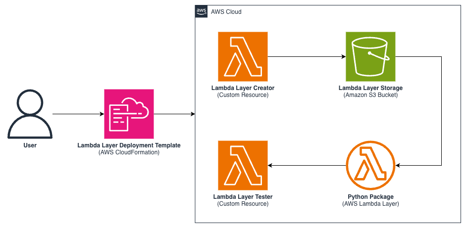

# AWS Lambda Layer Deployment Template for Python (aws-lambda-layer-deployment-template)

## Overview
This project will automate the deployment of AWS Lambda Layers for Python-based deployments using AWS CloudFormation. Traditional Lambda Layer management often leads to outdated dependencies, as layers are typically created manually and updated infrequently. This project is ideal for AWS developers and DevOps engineers who want to streamline their Lambda function management and ensure consistent Python package versions across their serverless applications.

## Use Cases
- **Serverless Applications**: Keep dependencies current across multiple Lambda functions
- **CI/CD Pipelines**: Automate Lambda Layer updates as part of your deployment process
- **Development Teams**: Standardize package versions across different environments
- **Security Compliance**: Ensure your functions use the latest, most secure package versions

## Architecture Diagram


The template creates and manages the following resources:
- Amazon S3 Bucket: Stores Lambda Layer ZIP packages
- Layer Creator Function: Creates and uploads Layer packages
  - IAM Role: Permissions for Layer creation and S3 upload
- Layer Test Function: Validates Layer deployments
  - IAM Role: AWSLambdaBasicExecutionRole Managed Policy
- AWS Lambda Layer: Native AWS::Lambda::LayerVersion resource

## Supported Configurations

### Supported Runtimes - AWS Lambda (Python)
- python3.10
- python3.11
- python3.12
- python3.13

### Supported Architectures - AWS Lambda
- arm64
- x86_64

### Supported Python Packages
| Package Name          | Import Name           | Description           |
| --------------------- | --------------------- | --------------------- |
| boto3                 | boto3                 | AWS SDK for Python    |
| requests              | requests              | HTTP requests library |
| urllib3               | urllib3               | HTTP client library   |
| aws-lambda-powertools | aws_lambda_powertools | AWS Lambda utilities  |
| aws-xray-sdk          | aws_xray_sdk          | AWS X-Ray tracing     |

**NOTE:**
1. The Python packages listed above are a subset of some of the most commonly used packages for AWS Lambda.
2. This project currently has logic in place to support 
   1. Single-word packages (e.g., 'boto3')
   2. Hyphenated packages with standard Python import naming (hyphen -> underscore)
3. This deployment will always use the latest package version from PyPI

## Author
Taylan Unal, Specialist Solutions Architect II, Amazon Web Services

## Contributing
See [CONTRIBUTING.md](CONTRIBUTING.md)

## Security
See [CONTRIBUTING](CONTRIBUTING.md#security-issue-notifications) for more information.

## License
This library is licensed under the MIT-0 License. See the [LICENSE](LICENSE) file.

## References
- [AWS Lambda Developer Guide - Managing Lambda dependencies with layers](https://docs.aws.amazon.com/lambda/latest/dg/configuration-layers.html)
- [PEP 423 – Naming conventions and recipes related to packaging](https://www.python.org/dev/peps/pep-0423/)

---

## Usage

### Prerequisites
- AWS CLI configured with appropriate permissions
- Python 3.10 or later
- AWS account with Lambda and S3 access

### Deployment

1. Clone the repository:
```bash
git clone https://github.com/aws-samples/lambda-layer-deployment-template.git
cd lambda-layer-deployment-template
```

2. Deploy with CloudFormation:
```bash
aws cloudformation deploy \
  --template-file template.yaml \
  --stack-name boto3-layer-stack \
  --capabilities CAPABILITY_IAM \
  --parameter-overrides \
    PackageName=boto3 \
    Runtime=python3.13 \
    Architecture=arm64
```

## Troubleshooting
1. **Layer Creation Failures**
   - Check CloudWatch logs for the `LayerCreatorFunction`
   - Verify PyPI package name is correct
   - Ensure S3 bucket permissions are properly configured

2. **Layer Testing Failures**
   - Examine `LayerTestCustomResource` logs in CloudWatch
   - Verify Python runtime compatibility
   - Check if package import name matches PyPI name

3. **Deployment Issues**
   - Ensure AWS CLI has sufficient permissions
   - Verify CloudFormation service role permissions
   - Check if the specified runtime/architecture combination is supported